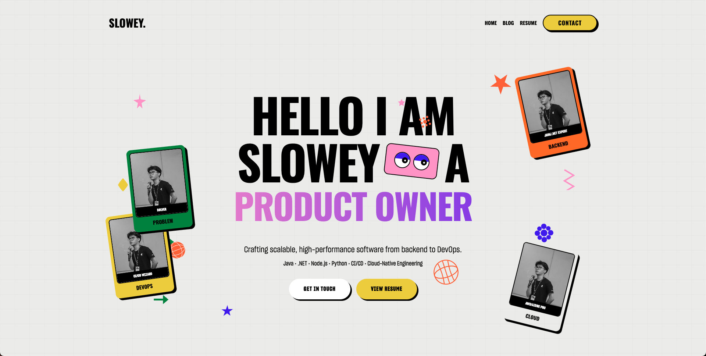

# Neobrutalist Portfolio Template

[](https://slowey.dev)
[](https://nextjs.org/)
[](https://react.dev/)
[](https://tailwindcss.com/)
[](LICENSE)

An open-source personal portfolio + blog template built with Next.js (Pages Router), React 19, and Tailwind CSS. Comes with a custom neobrutalist design system, a six-template project banner system, info-graphic blog hero banners, and a local-only authoring UI so you can edit content without touching code. Live demo at [slowey.dev](https://slowey.dev).



## Quick start

```bash
git clone https://github.com/sloweyyy/portfolio.git my-portfolio
cd my-portfolio
yarn install
yarn dev
```

App runs at `http://localhost:3000`. The repo uses **yarn** (`packageManager` is pinned to `yarn@1.22.19`); Vercel auto-detects it from `yarn.lock`.

## What's inside

**Homepage.** Rotating tagline, animated eye, big Oswald headlines. The project section ("Damn! I did this?") gives every project a 1600×900 banner instead of a stock thumbnail; pick one of six layouts (Big Type, Gradient Headline, Sticker Collage, Terminal/Code, Stats, Split/Evolution). Banners scale into the card and open full-size when clicked. Hall of fame, services, and work timeline sit below — all sourced from `data/portfolio.json`.

**Blog.** Plain markdown in `_posts/en/`. Each post shows a reading-time estimate, neobrutalist yellow blockquotes, a "Get in touch" pill at the bottom, and a three-card "Keep reading" strip. Any post can opt into a custom info-graphic hero by adding a single entry to `components/BlogBanner` (the bundled "Claude Code Insights" post is an example). Code blocks use Dracula via `react-syntax-highlighter`.

**Resume.** A `/resume` page sourced from the same `portfolio.json`.

**Local-only authoring.** In dev (`NODE_ENV === "development"`) there's an `/edit` page for editing portfolio + resume content, CRUD endpoints under `pages/api/blog/`, and a `Cmd + E` shortcut to open the editor from anywhere on the site. None of this ships in production.

**Contact.** A modal opened from the header or the blog post CTA. Sends mail through Nodemailer + Gmail, and writes to a Google Sheet if `googleapis` creds are configured.

**Other bits.** Custom mouse cursor (toggle via `data.showCursor`), Vercel Analytics + Speed Insights, and Playwright accessibility tests in `tests/playwright/`.

## Tech stack

| Layer | Tech |
| --- | --- |
| Framework | Next.js 16 (Pages Router), React 19, TypeScript 5 |
| Styling | Tailwind CSS 3, scoped CSS for banner systems, custom design tokens |
| Animation | Framer Motion + GSAP + React Spring |
| Markdown | gray-matter + remark + react-markdown + react-syntax-highlighter |
| Forms | Nodemailer (Gmail), googleapis (Sheets, optional) |
| Editor (dev only) | react-textarea-autosize, react-datepicker, custom CRUD APIs |
| Tooling | yarn 1.22, ESLint 9, Playwright |
| Hosting | Vercel (static + serverless functions) |

## Project structure

```text
pages/
  index.js              # Homepage
  resume.js             # Resume page
  edit.js               # Dev-only content editor
  blog/
    index.js            # Blog listing
    [slug].js           # Blog post (banner-aware)
  api/
    contact.js          # Nodemailer + Sheets handler
    blog/               # Dev-only blog CRUD
    portfolio.js        # Dev-only portfolio CRUD
components/
  ProjectBanner/        # Project banner system (6 templates, slug-keyed)
  BlogBanner/           # Slug-keyed blog hero banners
  ProjectSection/       # Homepage projects with banner-driven cards
  ContentSection/       # Markdown renderer with custom code/img/link/blockquote
  BlogEditor/           # Dev-only blog editor modal
  ContactForm/          # Modal contact form
  ...                   # Header, Footer, Cursor, ServiceCard, Toaster, etc.
data/
  portfolio.json        # All non-blog content
  locales/en.json       # UI strings
_posts/en/              # Markdown blog posts
styles/
  globals.css           # Design tokens, typography, base
  banners.css           # Project-banner design system (b1–b6, scoped to .project-banner-root)
  blog-banners.css      # Blog hero banners (scoped to .blog-banner-root)
  markdown.css          # Markdown content styles (incl. neobrutalist blockquote)
tests/playwright/       # UX / accessibility specs
```

## Make it yours

Most of what you'll change lives in three files:

1. **`data/portfolio.json`** — name, taglines, projects, services, hall of fame, work timeline, socials. Editable in-app via `/edit` (dev only, `Cmd + E`).
2. **`_posts/en/*.md`** — your blog posts. The dev-only blog editor can scaffold a new post for you, or just drop in a markdown file with YAML frontmatter.
3. **`components/ProjectBanner/index.js`** — the JSX content for each project banner, keyed by project `id`. Pick one of `b1`–`b6` (defined in `styles/banners.css`) and fill in the slots.

Other things you might tweak:

- **Blog hero banners** — add an entry in `components/BlogBanner/index.js` keyed by post slug; styles go in `styles/blog-banners.css`.
- **Color palette** — `--neo-pink`, `--neo-yellow`, `--neo-purple`, etc. are defined in `styles/globals.css` and referenced from `tailwind.config.js`.
- **Theme** — `pages/_app.js` runs `forcedTheme="light"`. Remove the prop (or change to `"dark"`) to re-enable `next-themes` toggling.
- **Cursor / animations** — toggle the custom cursor with `data.showCursor` in `portfolio.json`. Animation libraries are wired but only used where they earn their keep — strip what you don't want.
- **SEO** — update the `<title>`, `<meta>` tags, OG image, and the Vercel project's domain to match yours.

## Environment variables

Create `.env.local`:

```env
# Email (required for the contact form)
EMAIL_USER=<gmail-address>
EMAIL_APP_PASSWORD=<gmail-app-password>
EMAIL_FROM_NAME=<your-name>

# GitHub (required for the dev blog editor's API routes)
GITHUB_TOKEN=<personal-access-token>
GITHUB_OWNER=<github-username>
GITHUB_REPO=<repo-name>
```

| Var | Purpose |
| --- | --- |
| `EMAIL_USER` / `EMAIL_APP_PASSWORD` | Gmail account + [App Password](https://myaccount.google.com/apppasswords) for outbound mail. |
| `EMAIL_FROM_NAME` | Display name on outgoing emails. |
| `GITHUB_TOKEN` / `GITHUB_OWNER` / `GITHUB_REPO` | Used by `/api/blog` to commit markdown changes back to your repo (dev only). |

The contact form fails closed if `EMAIL_*` are missing. The blog APIs only run when `NODE_ENV === "development"`, so the GitHub vars are optional in production.

## Scripts

| Command | What it does |
| --- | --- |
| `yarn dev` | Start the Next.js dev server on port 3000. |
| `yarn build` | Production build. |
| `yarn start` | Run the built app. |
| `yarn lint` | ESLint. |
| `npx playwright test` | Run the full accessibility / UX suite. |
| `npx playwright test --project=desktop` | Desktop viewport only. |
| `npx playwright test --project=mobile` | Mobile viewport only. |

Playwright auto-starts the dev server if it isn't running.

## Deploy

Easiest path: push to your own GitHub repo and import it on [Vercel](https://vercel.com/new). The build step runs `yarn install` followed by `yarn build` automatically. Set `EMAIL_USER`, `EMAIL_APP_PASSWORD`, and `EMAIL_FROM_NAME` in the Vercel project's environment variables for the contact form to work in production.

[](https://vercel.com/new/clone?repository-url=https%3A%2F%2Fgithub.com%2Fsloweyyy%2Fportfolio&env=EMAIL_USER,EMAIL_APP_PASSWORD,EMAIL_FROM_NAME&envDescription=Gmail%20App%20Password%20for%20the%20contact%20form&project-name=my-portfolio&repository-name=my-portfolio)

`yarn.lock` is the source of truth; `package-lock.json` is gitignored so an accidental `npm install` won't sneak it back in.

## Contributing

Issues and PRs are welcome. If you build something with this template, drop a link — it's nice to see what people make.

## License

MIT — see [LICENSE](LICENSE). Use it, fork it, ship your own thing.
