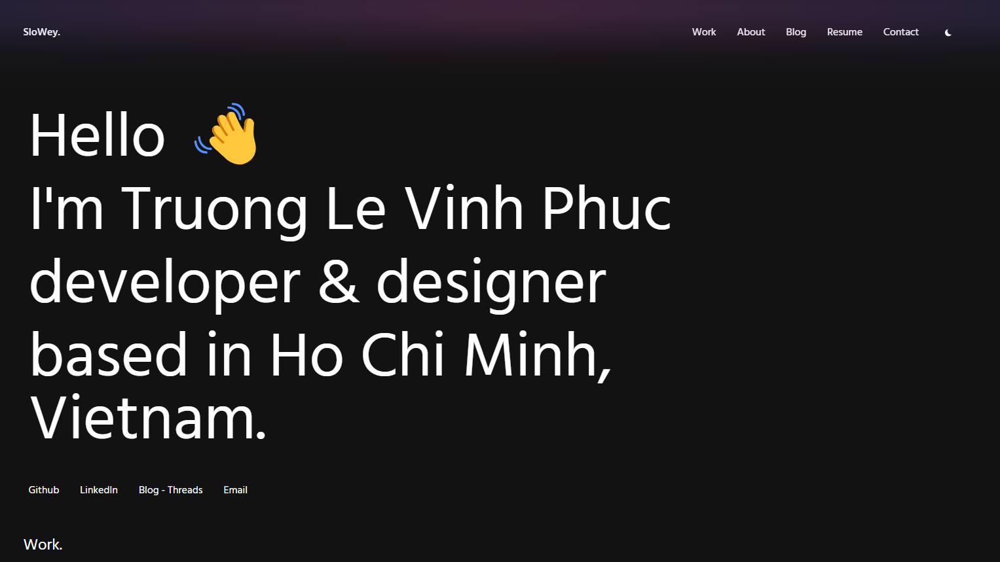

# SloWey Portfolio Website 🚀

[](https://www.slowey.works)


[](https://vercel.com/new/clone?repository-url=https%3A%2F%2Fgithub.com%2Fsloweyyy%2Fportfolio&env=MONGODB_URI,MONGODB_DB,JWT_SECRET,GITHUB_TOKEN,GITHUB_OWNER,GITHUB_REPO&demo-title=SloWey%20Portfolio&demo-url=https%3A%2F%2Fwww.slowey.works%2F)

This is a modern and performant personal portfolio website and blog, built with Next.js and Tailwind CSS. It features a clean, minimal design with dark mode support, showcasing projects, skills, and blog posts.



## Features ✨

- **Modern Tech Stack:** Built with Next.js 15 and Tailwind CSS 3.3.
- **Dark Mode:** Built-in dark/light theme toggle using `next-themes`.
- **Blog System:** Markdown-based blog with basic CRUD operations (create, read, update, delete), includes a basic editor.
- **Responsive Design:**  Fully responsive and works seamlessly across all devices.
- **Smooth Animations:** Implemented with GSAP and Framer Motion.
- **Interactive UI:** Smooth animations and transitions.
- **Contact Form:** Integrated with Google Sheets API for easy data collection.
- **Admin Panel:** Basic login to edit portfolio data and blogs.
- **Custom Cursor:** Enabled a custom cursor on hoverable elements.
- **Konami Code:** Secret key combination to navigate to admin panel.
- **Easy Customization:**  Portfolio data, resume and blog posts are managed via files or API and a simple editor.

## Tech Stack 💻

- **Framework:** Next.js 15
- **Styling:** Tailwind CSS 3.3
- **Animation:** GSAP & Framer Motion
- **State Management:** React Context
- **Markdown Processing:** Gray Matter & Remark
- **Form Handling:** Nodemailer + Google Sheets API
- **Database:** MongoDB (for user authentication)
- **Deployment:** Vercel

## Getting Started 🚀

1. **Clone the repository:**

    ```bash
    git clone https://github.com/sloweyyy/portfolio.git
    ```

2. **Navigate to the project directory:**

    ```bash
    cd portfolio
    ```

3. **Install dependencies:**

    ```bash
    npm install
    ```

4. **Set up environment variables:**

    Create a `.env.local` file in the root directory and add the following variables:

    ```env
    MONGODB_URI=<your_mongodb_uri>
    MONGODB_DB=<your_mongodb_db>
    JWT_SECRET=<your_jwt_secret>
    GITHUB_TOKEN=<your_github_token>
    GITHUB_OWNER=<your_github_username>
    GITHUB_REPO=<your_github_repo>
    EMAIL_USER=<your_email>
    EMAIL_FROM_NAME=<"your_name">
    EMAIL_APP_PASSWORD=<your_email_app_password>
    ```

    - **MONGODB_URI:** Your MongoDB connection string.
    - **MONGODB_DB:** The name of your MongoDB database.
    - **JWT_SECRET:** A secret key for JWT token generation.
    - **GITHUB_TOKEN:** A personal access token for GitHub API.
    - **GITHUB_OWNER:** Your GitHub username.
    - **GITHUB_REPO:** The repository name for the blog posts.
    - **EMAIL_USER:** Your email address.
    - **EMAIL_FROM_NAME:** Your name.
    - **EMAIL_APP_PASSWORD:** Your email app password.
5. **Run the development server:**

    ```bash
    npm run dev
    ```

    The app will be available at `http://localhost:3000`.

## Key Configuration Points

- **`data/portfolio.json`:** Contains the main data for the portfolio (projects, services, about, socials, etc.).
- **`_posts/`:** Directory holding all blog posts as Markdown files.
- **`pages/api/`:** API routes for user authentication, contact form handling and data management.
- **`components/`:** Contains all the reusable react components.

## Admin Access

- **Login Page:** Access by navigating to `/edit` while the development environment is running.
- **Credentials:** You can seed a new admin user by using `npm run seed` in terminal.
- **Konami Code:** Special key combination `Up, Up, Down, Down, Left, Right, Left, Right, B, A` can also be used to navigate to the admin panel.

## Customization

- **Modify `data/portfolio.json`:**  Update the portfolio content, resume details, etc.
- **Add/Edit Blog Posts:** Create or edit Markdown files in the `_posts` directory.
- **Styling:** Make customizations using Tailwind config in `tailwind.config.js` or by modifying CSS in `/styles/`
- **Theme**: Customize the dark mode and theme in general with `components/Header/index.js`, `components/Button/index.js`

## Deployment 🚀

Deploy to Vercel using the Vercel CLI or through the Vercel platform. The project is configured for Vercel deployment.

## License 📄

This project is licensed under the MIT License - see the [LICENSE](LICENSE) file for details.
